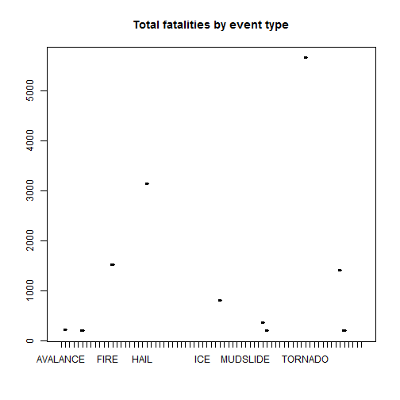

US National Weather Service Storm Data. Impact on population health and economic consequences
========================================================
# Synopsis  
In this analysis we process the data regarding US severe ewather events that 
can cause public health and economic problems. These events can have a 
significant cost in human fatalities and injuries as well as property damage and
other financial consequences. We start by downloading online the NOOA database 
from: https://d396qusza40orc.cloudfront.net/repdata%2Fdata%2FStormData.csv.bz2.
We continue by cleaning our data and aggregating to find the Event Types with
the most important outcomes. We present our results using plots. The analysis
was performed with version 0.98.501 of RStudia on Windows 8 x64


# Data Processing  

### Download initial datafile 

```r
myurl <- "http://d396qusza40orc.cloudfront.net/repdata%2Fdata%2FStormData.csv.bz2"
download.file(url = myurl, destfile = "StormData.csv.bz2")
```


### Extract csv file and read into a dataframe variable

```r
extracted.file <- bzfile("StormData.csv.bz2")
mydata <- read.csv(extracted.file)
```

### Have a first glance at data

```r
str(mydata)
```

```
## 'data.frame':	902297 obs. of  37 variables:
##  $ STATE__   : num  1 1 1 1 1 1 1 1 1 1 ...
##  $ BGN_DATE  : Factor w/ 16335 levels "1/1/1966 0:00:00",..: 6523 6523 4242 11116 2224 2224 2260 383 3980 3980 ...
##  $ BGN_TIME  : Factor w/ 3608 levels "00:00:00 AM",..: 272 287 2705 1683 2584 3186 242 1683 3186 3186 ...
##  $ TIME_ZONE : Factor w/ 22 levels "ADT","AKS","AST",..: 7 7 7 7 7 7 7 7 7 7 ...
##  $ COUNTY    : num  97 3 57 89 43 77 9 123 125 57 ...
##  $ COUNTYNAME: Factor w/ 29601 levels "","5NM E OF MACKINAC BRIDGE TO PRESQUE ISLE LT MI",..: 13513 1873 4598 10592 4372 10094 1973 23873 24418 4598 ...
##  $ STATE     : Factor w/ 72 levels "AK","AL","AM",..: 2 2 2 2 2 2 2 2 2 2 ...
##  $ EVTYPE    : Factor w/ 985 levels "   HIGH SURF ADVISORY",..: 834 834 834 834 834 834 834 834 834 834 ...
##  $ BGN_RANGE : num  0 0 0 0 0 0 0 0 0 0 ...
##  $ BGN_AZI   : Factor w/ 35 levels "","  N"," NW",..: 1 1 1 1 1 1 1 1 1 1 ...
##  $ BGN_LOCATI: Factor w/ 54429 levels "","- 1 N Albion",..: 1 1 1 1 1 1 1 1 1 1 ...
##  $ END_DATE  : Factor w/ 6663 levels "","1/1/1993 0:00:00",..: 1 1 1 1 1 1 1 1 1 1 ...
##  $ END_TIME  : Factor w/ 3647 levels ""," 0900CST",..: 1 1 1 1 1 1 1 1 1 1 ...
##  $ COUNTY_END: num  0 0 0 0 0 0 0 0 0 0 ...
##  $ COUNTYENDN: logi  NA NA NA NA NA NA ...
##  $ END_RANGE : num  0 0 0 0 0 0 0 0 0 0 ...
##  $ END_AZI   : Factor w/ 24 levels "","E","ENE","ESE",..: 1 1 1 1 1 1 1 1 1 1 ...
##  $ END_LOCATI: Factor w/ 34506 levels "","- .5 NNW",..: 1 1 1 1 1 1 1 1 1 1 ...
##  $ LENGTH    : num  14 2 0.1 0 0 1.5 1.5 0 3.3 2.3 ...
##  $ WIDTH     : num  100 150 123 100 150 177 33 33 100 100 ...
##  $ F         : int  3 2 2 2 2 2 2 1 3 3 ...
##  $ MAG       : num  0 0 0 0 0 0 0 0 0 0 ...
##  $ FATALITIES: num  0 0 0 0 0 0 0 0 1 0 ...
##  $ INJURIES  : num  15 0 2 2 2 6 1 0 14 0 ...
##  $ PROPDMG   : num  25 2.5 25 2.5 2.5 2.5 2.5 2.5 25 25 ...
##  $ PROPDMGEXP: Factor w/ 19 levels "","-","?","+",..: 17 17 17 17 17 17 17 17 17 17 ...
##  $ CROPDMG   : num  0 0 0 0 0 0 0 0 0 0 ...
##  $ CROPDMGEXP: Factor w/ 9 levels "","?","0","2",..: 1 1 1 1 1 1 1 1 1 1 ...
##  $ WFO       : Factor w/ 542 levels ""," CI","$AC",..: 1 1 1 1 1 1 1 1 1 1 ...
##  $ STATEOFFIC: Factor w/ 250 levels "","ALABAMA, Central",..: 1 1 1 1 1 1 1 1 1 1 ...
##  $ ZONENAMES : Factor w/ 25112 levels "","                                                                                                                               "| __truncated__,..: 1 1 1 1 1 1 1 1 1 1 ...
##  $ LATITUDE  : num  3040 3042 3340 3458 3412 ...
##  $ LONGITUDE : num  8812 8755 8742 8626 8642 ...
##  $ LATITUDE_E: num  3051 0 0 0 0 ...
##  $ LONGITUDE_: num  8806 0 0 0 0 ...
##  $ REMARKS   : Factor w/ 436781 levels "","-2 at Deer Park\n",..: 1 1 1 1 1 1 1 1 1 1 ...
##  $ REFNUM    : num  1 2 3 4 5 6 7 8 9 10 ...
```

```r
names(mydata)
```

```
##  [1] "STATE__"    "BGN_DATE"   "BGN_TIME"   "TIME_ZONE"  "COUNTY"    
##  [6] "COUNTYNAME" "STATE"      "EVTYPE"     "BGN_RANGE"  "BGN_AZI"   
## [11] "BGN_LOCATI" "END_DATE"   "END_TIME"   "COUNTY_END" "COUNTYENDN"
## [16] "END_RANGE"  "END_AZI"    "END_LOCATI" "LENGTH"     "WIDTH"     
## [21] "F"          "MAG"        "FATALITIES" "INJURIES"   "PROPDMG"   
## [26] "PROPDMGEXP" "CROPDMG"    "CROPDMGEXP" "WFO"        "STATEOFFIC"
## [31] "ZONENAMES"  "LATITUDE"   "LONGITUDE"  "LATITUDE_E" "LONGITUDE_"
## [36] "REMARKS"    "REFNUM"
```


### For our analysis we are interested only in the following columns:  
EVTYPE, FATALITIES, INJURIES, PROPDMG, PROPDMGEXP, CROPDMG, CROPDMGEXP
### So we create a new data frame containing only these columns


```r
keep <- c("EVTYPE", "FATALITIES", "INJURIES", "PROPDMG", "PROPDMGEXP", "CROPDMG", 
    "CROPDMGEXP")
mydata2 <- mydata[keep]
names(mydata2)
```

```
## [1] "EVTYPE"     "FATALITIES" "INJURIES"   "PROPDMG"    "PROPDMGEXP"
## [6] "CROPDMG"    "CROPDMGEXP"
```


### Now we focus in the EVTYPE column

```r
len <- length(unique(mydata2$EVTYPE))
print(len)
```

```
## [1] 985
```

### So we have 985 different event types
### Let's convert column to uppercase

```r
mydata2$EVTYPE <- toupper(mydata2$EVTYPE)
len2 <- length(unique(mydata2$EVTYPE))
print(len2)
```

```
## [1] 898
```

### We see that we managed to reduce the different event types to 898

### Event type has values like **"TORNADO F2"** and **"TORNADO F3"** so we consolidate these values 

```r
mydata2$EVTYPE[grep("TORNADO", mydata2$EVTYPE)] <- "TORNADO"
mydata2$EVTYPE[grep("FLOOD", mydata2$EVTYPE)] <- "FLOOD"
mydata2$EVTYPE[grep("RAIN", mydata2$EVTYPE)] <- "RAIN"
mydata2$EVTYPE[grep("FIRE", mydata2$EVTYPE)] <- "FIRE"
mydata2$EVTYPE[grep("HEAT", mydata2$EVTYPE)] <- "HEAT"
mydata2$EVTYPE[grep("SNOW", mydata2$EVTYPE)] <- "SNOW"
mydata2$EVTYPE[grep("WIND", mydata2$EVTYPE)] <- "WIND"
mydata2$EVTYPE[grep("COLD", mydata2$EVTYPE)] <- "COLD"
mydata2$EVTYPE[grep("THUNDERSTORM", mydata2$EVTYPE)] <- "THUNDERSTORM"
mydata2$EVTYPE[grep("HAIL", mydata2$EVTYPE)] <- "HAIL"
mydata2$EVTYPE[grep("ICE", mydata2$EVTYPE)] <- "ICE"
mydata2$EVTYPE[grep("HURRICANE", mydata2$EVTYPE)] <- "HURRICANE"


len3 <- length(unique(mydata2$EVTYPE))
print(len3)
```

```
## [1] 335
```

### Now we managed to reduce the different event types to 335

### Aggregate by Event type to get sum by injuries and fatalities

```r
library(plyr)
groupByInjuries <- ddply(mydata2, ~EVTYPE, summarise, sum = sum(INJURIES))
groupByInjuries <- groupByInjuries[groupByInjuries$sum > 0, ]
groupByInjuries$EVTYPE <- factor(groupByInjuries$EVTYPE)

groupByFatalities <- ddply(mydata2, ~EVTYPE, summarise, sum = sum(FATALITIES))
groupByFatalities <- groupByFatalities[groupByFatalities$sum > 0, ]
groupByFatalities$EVTYPE <- factor(groupByFatalities$EVTYPE)
```


# Results
### Order the grouped datasets and plot to find the most harmful event types


```r
groupByInjuries <- groupByInjuries[order(groupByInjuries$sum, decreasing = T), 
    ]
groupByInjuries2 <- groupByInjuries[1:10, ]
with(groupByInjuries2, plot(EVTYPE, sum, main = "Total injuries by event type", 
    col = "darkred"))
```

 

```r

groupByFatalities <- groupByFatalities[order(groupByFatalities$sum, decreasing = T), 
    ]
groupByFatalities <- groupByFatalities[1:10, ]
with(groupByFatalities, plot(EVTYPE, sum, main = "Total fatalities by event type", 
    col = "darkred"))
```

 


### Therefore tornados have the most impact on fatalities and injuries
